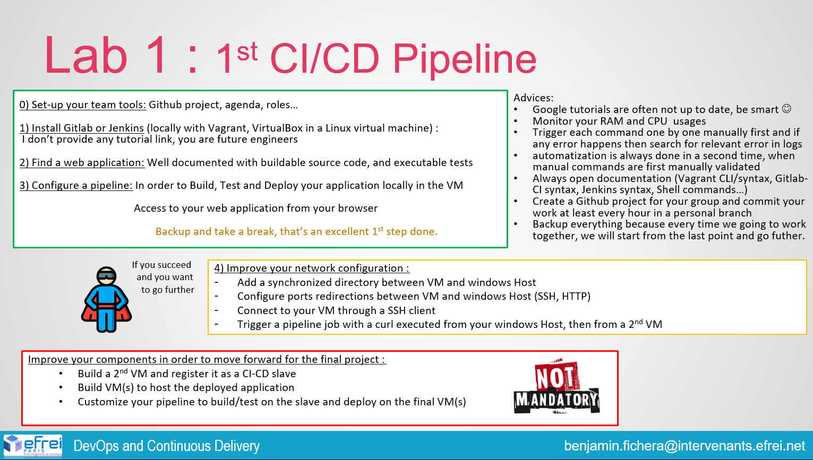

# Lab 1 - Gitlab pipeline



## Objectives

- [x] Setup your team tools
- [x] Install Gitlab (with docker)
- [ ] Find a web application
- [ ] Configure a pipeline
- [ ] Improve your network configuration
  - [x] Add synchronized directories between the host and the VM
  - [x] Configure port forwarding (ssh, http)
  - [x] Connect to the VM with ssh client
  - [ ] Trigger a pipeline with a curl from host and a second VM
- [ ] Improve yout components in order to move forward
  - [ ] Build a second docker and register as a runner
  - [ ] Build a VM to deploy the app
  - [ ] Customize your pipeline to build/test on the runner and deploy on the final VM

## Installation

### Configuration password and repository

Start VM

```bash
cd lab1
vagrant up
vagrant ssh
```

Start gitlab and gitlab-runner with docker compose

```bash
cd /vagrant_data
sudo docker compose up
```

Wait for the gitlab to boot on <http://localhost:8080/>

Login into gitlab with ```root``` and the password given by the following command

```bash
sudo docker exec -it gitlab grep 'Password:' /etc/gitlab/initial_root_password
```

In the gitlab UI, change the password of the root user and create a new repository for example "test-app".

***The configuration steps need to be done once since you don't destroy the VM***

### Configuration runner

get the ip address of the docker containers

```bash
sudo docker inspect -f '{{range .NetworkSettings.Networks}}{{.IPAddress}}{{end}}' gitlab
```

```bash
sudo docker inspect -f '{{range .NetworkSettings.Networks}}{{.IPAddress}}{{end}}' gitlab-runner
```

register the runner

```bash
sudo docker run --rm -it -v gitlab-runner-config:/etc/gitlab-runner gitlab/gitlab-runner register
```

then enter the info asked

```bash
Please enter the gitlab-ci coordinator URL (e.g. https://gitlab.com/): # the ip address of the gitlab container
Please enter the gitlab-ci token for this runner: # get the token in the gitlab UI (admin area -> runners -> ... next to instance runner)
