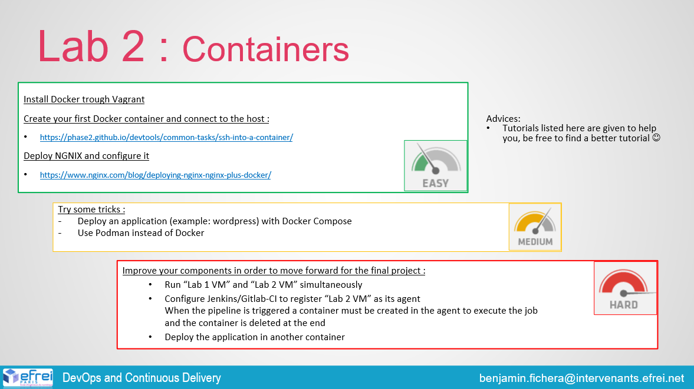

# Lab 2 - NGINX and Docker

## Objectives

- [x] Install Docker through Vagrant
- [x] Create a Docker container and connect to the host
- [x] Deploy NGINX and configure it
- [ ] Some tricks
  - [x] Deploy an app like Wordpress
  - [ ] Use Podman instead of Docker
- [ ] Improve your components in order to move forward
  - [ ] Run Lab 1 and Lab 2 simultaneously
  - [ ] Configure Gitlab CI to register lab2 VM as its agent (when the pipeline is triggered a container is created in the agent to execute the job and then destroyed)
  - [ ] Deploy the application in another container

## Installation
